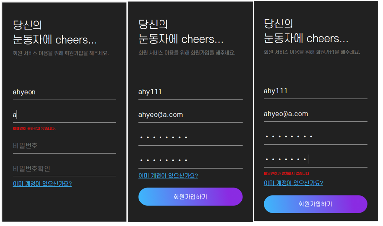
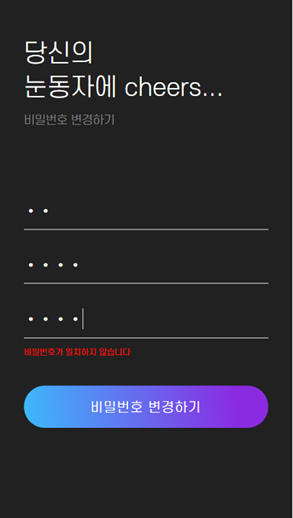

# ✨ 프로젝트 개요

-  **협업규칙**
   -  1일 1커밋, 1주 1MR(Merge Request) 1인 프로젝트라도 master 브랜치에서 작업하지 말자(연습)
   -  Jira 이슈 관리
   -  Sub1은 개인프로젝트이지만 팀으로 대응!! (이슈 발생 시 팀원 공유)
   -  gitlab > README.md 정리 중요!!
   -  Sub1 기간 => 차주 팀프로젝트 준비(기획, 프로젝트 규칙 등)
-  **이번 Sprint 목표**
   -  sub1 프로젝트 구현(README.md에 내용 정리 포함)
   -  팀 프로젝트를 위한 도구 연습. Gitlab, Jira 등
   -  팀프로젝트 개발 환경 구축
   -  React에 대한 전반적인 학습(개요 수준!)


# ⚙️ Install and Usage

### Frontend

- frontend 폴더로 들어와 필요한 패키지를 설치합니다.

  ```bash
  yarn
  ```

- frontend app을 실행합니다.

  ```bash
  yarn start
  ```


### Backend

- Java (Open JDK 14)를 설치합니다.
- Maven을 설치합니다.
  - VSCode에서 Maven 하단의 webcuration에서 우클릭 후 install
- VS Code에서 Spring Boot Extension Pack 설치합니다.
- Docker를 설치합니다.

> Maria DB 컨테이너 실행

- `docker run --name-db -p 3306:3306 -e MYSQL_ROOT_PASSWORD={패스워드} -d mariddb`
  - 패스워드를 칠 때는, 대괄호를 지우고 칩니다.
- `docker exec -it maria-db mysql -u root -p`
  - docker를 켜고, maria-db를 실행하기 위한 코드입니다.

> DB 테이블 생성

- DB 테이블을 생성합니다.

> backend 앱을 실행합니다.

- `./mvnw spring-boot:run`

# 🏠 주요 기능

**로그인 기능**

> F로그인 페이지

- 모바일에서 입력 시 이메일 Input의 첫 글자가 대문자가 되는 현상으로 인해 로그인 실패가 발생하지 않도록 구현
- 로그인 실패 시 사용자에게 에러메시지 노출
- 이메일 형식 입력 및 비밀번호 입력 기준 충족 시에만 '로그인 버튼 활성화'


**회원 관리**

> 회원가입 페이지

- 가입 필수 항목 모두 입력 시에만 '가입 완료' 버튼 활성화
- 이메일 형식 입력 및 비밀번호 입력 기준 충족 못할 시 오류 메시지 노출
- 모바일에서 입력 시 이메일 Input의 첫 글자가 대문자가 되는 현상으로 인해 로그인 실패가 발생하지 않도록 구현
- 회원가입 완료 후 회원가입 인증 메일이 발송되었습니다. 이메일을 확인해주세요 메세지 출력
- 메일 재발송, 메일함으로 이동 등 사용자 편의 사항을 고려한 버튼 등을 적용



**비밀번호 변경 페이지 제작**

- 비밀번호 입력 기준이 충족되었을 때, '저장' 버튼 활성화
- 비밀번호 변경 성공 시 사용자에게 피드백 노출
- 비밀번호 변경 실패 시 에러 메시지 노출


**Page Not Found 페이지** 

- 존재하지 않는 요청 시 Page Not Found 페이지로 이동


**Error 페이지**

- 웹 페이지에 오류가 발생하는 경우 Error 페이지로 이동


# React 정리

`create-react-app`설치

```shell
yarn global add create-react-app
```

리액트 앱 생성

```shell
create-react-app <react-app-name>
```

### 컴포넌트 단축키

| 키워드 | 설명                                               |
| ------ | -------------------------------------------------- |
| RCC    | 기본리액트 컴포넌트 코드를 생성합니다              |
| RCCP   | 리액트 컴포넌트를 프로퍼티 타입과 함께 생성합니다. |
| RCFC   | 리액트 컴포넌트를 생명주기 함수와 함께 생성합니다. |
| RPC    | 리액트 퓨어 컴포넌트를 생성합니다                  |
| RSC    | 함수형 컴포넌트를 생성합니다                       |
| RSCP   | 함수형 컴포넌트를 프로퍼티 타입과 함께 생성합니다  |

### 컴포넌트 구성 요소

| 데이터 구성 요소 | 특징                                                         |
| ---------------- | ------------------------------------------------------------ |
| 프로퍼티         | 상위 컴포넌트에서 하위 컴포넌트로 전달되는 읽기 전용 데이터입니다. |
| state            | 컴포넌트의 상태를 저장하고 변경할 수 있는 데이터입니다.      |
| 컨텍스트         | 부모 컴포넌트에서 생성하여 모든 자식 컴포넌트에 전달하는 데이터입니다. |
| 리덕스           | 서버에서 받은 데이터를 앱 전체에 전달하거나 관리합니다.      |

### 프로퍼티

#### 프로퍼티 활용

`./src/PropsComponent.jsx`

```js
import React, { Component } from "react";
import PropTypes from "prop-types";

class PropsComponent extends Component {
  render() {
    return <div className="message-container">{this.props.name}</div>;
  }
}

PropsComponent.propTypes = {
  name: PropTypes.string,
};

export default PropsComponent;
```

`./src/App.jsx`

```js
import React, { Component } from "react";
import PropsComponent from "./PropsComponent";
import "./App.css";

class App extends Component {
  render() {
    return (
      <div className="body">
        <PropsComponent name="안녕하세요?" />
      </div>
    );
  }
}
export default App;
```

#### 다양한 프로퍼티 사용하기

```js
import React, { Component } from "react";
import PropTypes from "prop-types";

class ChildComponent extends Component {
  render() {
    // 객체 구조 분해 할당식으로 render()함수 내의 지역 변수로 재 정의
    const {
      boolValue,
      numValue,
      arrayValue,
      objValue,
      nodeValue,
      funcValue,
    } = this.props;
    return (
      <div>
        <span>불리언값: {boolValue}</span>
        <span>숫자값: {numValue}</span>
        <span>배열값: {arrayValue}</span>
        <span>객체값: {objValue}</span>
        <span>노드값: {nodeValue}</span>
        <span>함수값: {funcValue}</span>
      </div>
    );
  }
}
// 객체 형태로 프로퍼티의 자료형 정의
ChildComponent.propTypes = {
  boolValue: PropTypes.bool,
  numValue: PropTypes.number,
  arrayValue: PropTypes.arrayOf(PropTypes.number),
  objValue: PropTypes.object,
  nodeValue: PropTypes.node,
  funcValue: PropTypes.func,
};

export default ChildComponent;
```

`App.jsx`

```jsx
import React, { Component } from "react";
import PropsComponent from "./PropsComponent";
import "./App.css";

class App extends Component {
  render() {
    const array = [1, 2, 3];
    return (
      <div className="body">
        <ChildComponent
          boolValue={true}
          numValue={1}
          // 실수를 줄이기 위해 변수에 객체를 담는 방식을 선호함
          arrayValue={array}
          objValue={{ name: "제목", age: 30 }}
          nodeValue={<h1>노드</h1>}
          funcValue={() => {
            console.log("메시지");
          }}
        />
      </div>
    );
  }
}
export default App;
```

#### 불리언 프로퍼티 사용하기

프로퍼티에 true 전달

```jsx
<ChildComponent boolValue />
```

프로퍼티에 false 전달

```jsx
<ChildComponent />
```

#### 객체형 프로퍼티 사용하기

```jsx
import React, { Component } from "react";
import PropTypes from "prop-types";

class ChildComponent2 extends Component {
  render() {
    const { objValue } = this.props;
    return (
      <div>
        // 객체를 문자열로 변환하여 출력
        <span>객체값: {String(Object.entries(objValue))}</span>
      </div>
    );
  }
}
// 객체 프로퍼티 자료형 정의
ChildComponent2.propTypes = {
  objValue: PropTypes.shape({
    name: PropTypes.string,
    age: PropTypes.number,
  }),
};

export default ChildComponent2;
```

#### 필수 프로퍼티 사용하기

```jsx
import React, { Component } from "react";
import PropTypes from "prop-types";

class ChildComponent2 extends Component {
  render() {
    const { objValue, requiredStringValue } = this.props;
    return (
      <div>
        <span>객체값: {String(Object.entries(objValue))}</span>
        <span>필수값: {requiredStringValue}</span>
      </div>
    );
  }
}
ChildComponent2.propTypes = {
  objValue: PropTypes.shape({
    name: PropTypes.string,
    age: PropTypes.number,
  }),
  // PropTypes에 정의된 변수 안의 특수 변수 isRequired를 이용하여 필수 프로퍼티로 지정
  requiredStringValue: PropTypes.string.isRequired,
};

export default ChildComponent2;
```

#### 프로퍼티에 기본값 지정하기

```jsx
ChildComponent2.propTypes = {
  boolValue: PropTypes.bool,
};
ChildComponent2.defaultProps = {
  voolValue: false,
};
```

#### 자식 프로퍼티 사용하기

`App.jsx`

```jsx
<ChildProperty>
  <div>
    <span>자식 노드</span>
  </div>
</ChildProperty>
```

`childProperty.jsx`

```jsx
class ChildProperty extends Component {
  render() {
    return <div>{this.props.children}</div>;
  }
}
ChildProperty.propTypes = {
  children: PropTypes.node,
};
```

### state

state를 사용할 때 주의 점

1. 생성자(constructor)에서 반드시 초기화해야 한다.
2. state값을 변경할 때는 setState() 함수를 반드시 사용해야 한다.
3. setState() 함수는 비동기로 처리되며, setState() 코드 이후로 연결된 함수들의 실행이 완료된 시점에 화면 동기화 과정을 거친다.

```jsx
import React, { Component } from "react";
import PropTypes from "prop-types";

class StateExample extends Component {
  constructor(props) {
    super(props);
    // 컴포넌트에서 관리하려는 변수 state 정의
    this.state = {
      loading: true,
      formData: "no data",
    };
    // 함수로 넘어갈 this는 반드시 bind로 묶어주어야 함
    this.handleData = this.handleData.bind(this);
    // 4초 뒤 handleData() 함수 호출
    setTimeout(this.handleData, 4000);
  }
  handleData() {
    const data = "new data";
    // 컴포넌트 특수 변수 this.state를 사용하여 state 값에 접근
    const { formData } = this.state;
    // 컴포넌트의 내장함수 this.setState()를 사용하여 state 변경
    this.setState({
      loading: false,
      formData: data + formData,
    });
    // this.state.loading은 현재 true입니다.
    console.log("loading값", this.state.loading);
  }

  render() {
    return (
      <div>
        {/* 컴포넌트 특수 변수 this.state를 사용하여 state값에 접근한다. */}
        <span>로딩중: {String(this.state.loading)}</span>
      </div>
    );
  }
}

StateExample.propTypes = {};

export default StateExample;
```

### 생명주기

```jsx
import React, { Component } from "react";
import PropTypes from "prop-types";

class Test extends Component {
  // 맨 처음 생성될 때 한번만 호출
  // 상태(state 또는 객체 변수)를 선언할 때 사용
  constructor(props) {
    super(props);
  }
  //
  componentWillMount() {
    console.log("componentWillMount");
  }
  // render() 함수가 JSX를 화면에 그린 이후에 호출되는 함수
  componentDidMount() {
    console.log("componentDidMount");
  }

  componentWillReceiveProps(nextProps) {
    console.log("componentWillReceiveProps");
  }
  // 프로퍼티를 변경하거나 setState() 함수를 호출하여 state값을 변경하면 화면을 새로 출력해야 하는지 판단
  shouldComponentUpdate(nextProps, nextState) {
    console.log("shouldComponentUpdate");
  }

  componentWillUpdate(nextProps, nextState) {
    console.log("componentWillUpdate");
  }
  // DOM정보를 변경할 때 사용
  componentDidUpdate(prevProps, prevState) {
    console.log("componentDidUpdate");
  }
  // 컴포넌트가 소멸되기 직전에 호출되는 함수
  componentWillUnmount() {
    console.log("componentWillUnmount");
  }
  // 데이터가 변경되어 새 화면을 그려야 할 때 자동으로 호출되는 함수
  render() {
    return <div></div>;
  }
}

Test.propTypes = {};

export default Test;
```

생명주기의 '생성 과정'

- 컴포넌트 생성 > `constructor` > `getDerivedStateFromProp` > `render` > `componentDidMount` > 생성 완료
- 생성완료 > `getDerivedStateFromProps` > `shouldComponentUpdate` > `render` > `getSnapshotBeforeUpdate` > `componentDidUpdate` > 갱신완료

### 함수형 컴포넌트

```jsx
import React from 'react';
import PropTypes from 'prop-types';

function SFC(props, context) {
  // 클래스 컴포넌트의 this.props값과 동일합니다.
  const { somePropValue } = props;
  // 클래스 컴포넌트의 this.context와 동일합니다.
  // context는 차후에 자세히 다룰 예정입니다.
  const { someContextValue } = context;
  return <h1>Hello, {somePropValue}</h1>;
}

SFC.propTypes = { somePropValue: PropTypes.any };
SFC.defaultProps = { somePropValue: 'default value' };

export default SFC;

```

### 여러개의 JSX 노드 반환하기

```jsx
render() {
    return (
        <React.Fragment>
        	<input />
            <input />
            <input />
        </React.Fragment>
    );
}
```

```jsx
render() {
    return (
        <>
        	<input />
            <input />
            <input />
        </>
    );
}
```

```jsx
render() {
    return [1, 2, 3].map((num) => (
    	<input />
    ));
}
```

### 컴포넌트에서 콜백 함수와 이벤트 처리하기

App 컴포넌트에서 state로 관리하는 count 값을 Counter 컴포넌트에서 변경할 수 있게 하기 위해 `increaseCount()`함수를 프로퍼티 형태로 전달한다.

```jsx
import React, { Component } from 'react';
import Counter from './Counter';

class App extends Component {
  constructor(props) {
      super(props);
      // increaseCount() 함수가 호출되는 this의 범위가 
      // App 컴포넌트에서 묶이게 bind() 함수 사용
      // 하위 컴포넌트인 Counter에서 실행되면 오류 발생!
      this.increaseCount = this.increaseCount.bind(this);
      this.state = {
          count: 1,
      };
  };
  increaseCount() {
      this.setState(({ count }) => ({ count: count + 1}));
  }
  render() {
    return (
       {/*  */}
      <Counter count={this.state.count} onAdd={this.increaseCount} />
    );
  }
}

export default App;

```


```jsx
import React from 'react';
import PropTypes from 'prop-types';

class Counter extends React.Component {
  render() {
    return (
      <div>
        현재 카운트: {this.props.count}
        <button
          onClick={() => this.props.onAdd()}
        >
          카운트 증가
        </button>
      </div>
    );
  }
}

Counter.propTypes = {
  count: PropTypes.number,
  onAdd: PropTypes.func,
};

export default Counter;
```

#### 컴포넌트에서 DOM 이벤트 사용하기

이벤트이름|이벤트 호출 시점|JSX DOM 이벤트 프로퍼티
-|-|-
click|엘리먼트의 마우스나 키보드가 클릭될 때|onClick
submit|폼의 데이터가 전송될 때|onSubmit
mousemove|엘리먼트 위에서 마우스 커서가 움직일 때|onMouseMove
mouseover|엘리먼트 영역 위로 마우스 커서가 돌아다닐 때|onMouseOver
mouseout|엘리먼트 위에 잇던 마우스 커서가 영역을 떠나갈 때|onMouseOut
keydown|키보드 버튼이 눌렸을 때|onKeyDown
keypress|키보드 버튼 입력이 완료되었을 때|onKeyPress

### 리덕스

- 리덕스
  
  - 서버에서 가져온 데이터를 이용하여 새로운 결과물 생성할 때
  
- 컨텍스트

  - 컴포넌트의 통합 데이터를 관리하는 경우

  

1. 스토어 생성하기

```jsx
createStore(reducer, /* initial state */, /* enhancer */)
```

리듀서, 스토어데이터의 초깃값(state), 미들웨어 함수를 인자로 받는다. state와 미들웨어는 생략해도 스토어가 생성된다.


### 리액트 라우터

| 라우터 컴포넌트 종류 | 설명                                                                   |
| -------------------- | ---------------------------------------------------------------------- |
| BrowswerRouter       | HTML5를 지원하는 브라우저의 주소를 감지합니다.                         |
| HashRouter           | 해시 주소(http://localhost#login)를 감지합니다.                        |
| MemoryRouter         | 메모리에 저장된 이전, 이후 주소로 이동시키는 라우터입니다.             |
| NativeRouter         | 리액트 네이티브를 지원하는 라우터입니다.                               |
| StaticRouter         | 브라우저의 주소가 아닌 프로퍼티로 전달된 주소를 사용하는 라우터입니다. |
